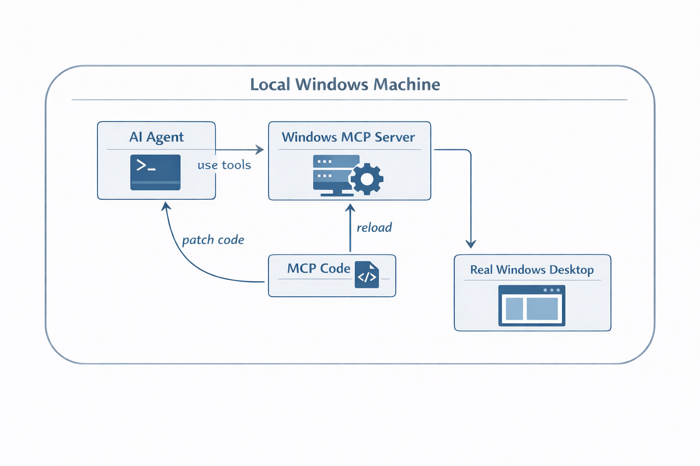

# Windows-MCP Reliability Research Fork

This repository is a research fork of [CursorTouch/Windows-MCP](https://github.com/CursorTouch/Windows-MCP), inspired by [karpathy/autoresearch](https://github.com/karpathy/autoresearch).

It is for one job: improve the real-world reliability of AI-driven Windows desktop automation.

The agent uses the MCP server, edits the MCP server, hot reloads it locally, reruns the same workflow, and checks whether the real desktop behavior got better.



## What Makes This Fork Different

- local `--dev hot` support is part of the normal workflow
- the same agent can patch the MCP code it is currently using
- changes are judged by real postconditions, not tool success strings
- `research/` exists to support benchmarks and handoff, not to collect random notes

## Setup

Replace the placeholders with your own paths:

- Windows repo path: `<windows-repo-path>`
- WSL repo path: `<wsl-repo-path>`

Windows host:

```powershell
git clone <your-fork-or-upstream-url> <windows-repo-path>
cd <windows-repo-path>
uv sync
uv run windows-mcp --dev hot
```

WSL side:

```bash
cd <wsl-repo-path>
uv run pytest -q
```

If Codex launches the MCP server itself:

```json
{
  "command": "uv",
  "args": [
    "--directory",
    "<windows-repo-path>",
    "run",
    "windows-mcp",
    "--dev",
    "hot"
  ]
}
```

If your client does not inherit `PATH` correctly, use an absolute executable path as a fallback.

## Hot Reload Loop

1. Reproduce one real failure.
2. Patch the MCP code.
3. Reload the worker.
4. Rerun the workflow immediately.
5. Verify the actual Windows state.

Good verification looks like:

- the foreground window really changed
- the text really appeared
- the file really exists
- the DOM really matches
- the next step still works from the new state

## Repo Guide

- `src/windows_mcp/`: server code
- `tests/`: regression tests
- `research/`: failures, benchmarks, result logs
- `AGENTS.md`: agent rules for this fork
- `CONTRIBUTING.md`: contributor workflow

The main `research/` files are:

- `failure_taxonomy.md`
- `test_matrix.md`
- `patches.md`
- `next_session.md`
- `results/*.md`

See [research/README.md](./research/README.md).

## Contributing

See [CONTRIBUTING.md](./CONTRIBUTING.md).
