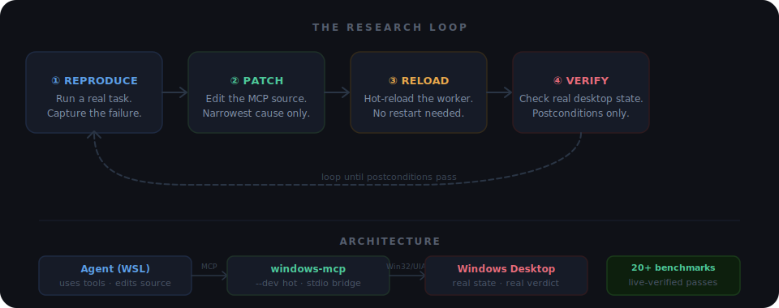

# Windows-MCP — Reliability Research Fork

> A research fork of [CursorTouch/Windows-MCP](https://github.com/CursorTouch/Windows-MCP), inspired by [karpathy/autoresearch](https://github.com/karpathy/autoresearch).
> The agent runs real Windows tasks, finds where the MCP server breaks, patches it, hot-reloads it, and checks whether the actual desktop state improved.



---

## What this fork is for

The upstream project provides the MCP server. This fork adds one thing: **a closed loop where the agent improves the server it is currently using.**

The agent does not get credit for a tool returning `"success"`. It gets credit when the foreground window really changed, the text really appeared, the file really exists. Every fix in this fork was driven by a documented failure on a real machine and verified by re-running the same task after the patch.

---

## What was hardened

These are the concrete changes in this fork, each tied to a reproduced failure:

| Area | What changed |
|------|-------------|
| **App.launch** | Verifies process/window state instead of matching the returned title against the requested app name. Fixes false-negative launches on localized Windows (e.g. `记事本` ≠ `Notepad`). |
| **App.switch** | Reads the foreground handle after every switch attempt. Fails closed if focus did not change. Runs a UIA fallback before giving up. |
| **Snapshot freshness** | Exposes native informative text (calculator display values, read-only labels). Rejects stale cached state after 10 seconds so label-based actions do not silently land in the wrong place. |
| **Hot mode transport** | Replaced the internal HTTP worker bridge with a persistent stdio bridge. Long-running forwarded calls (e.g. `PowerShell Start-Sleep 8`) no longer hang at the 120-second host deadline. |
| **Wait tool** | Moved `Wait` execution into the shell instead of forwarding it to the worker. Eliminates the class of timeout failures specific to long waits under hot mode. |
| **DevServer diagnostics** | `health` and `reload` now return promptly. Added shell identity fields (`shell_source_hash`, `shell_restart_required`) so the agent can detect when a shell restart is needed versus a worker reload. |
| **Browser DOM scrape** | Fixed `Scrape(use_dom=true)` crash: scroll metadata is read from the actual `ScrollElementNode.metadata`, not as a missing attribute. |
| **Coordinate contract** | `Click`, `Type`, `Move`, and `Scroll` now accept both string (`"500,400"`) and list (`[500, 400]`) `loc` values. Eliminates schema mismatch failures from tool wrapper/server divergence. |
| **Protocol launch** | `App(mode="launch", name="ms-settings:bluetooth")` works. Settings navigation prefers `ms-settings:*` deep links over fragile click-driven sidebar navigation. |
| **Keyboard input** | Fixed `NameError: _INPUTUnion` in `uia/core.py` by adding an explicit import. Star-imports do not pull underscore-prefixed names. |

---

## Benchmark results

All tasks below were run against a real Windows machine via the live MCP server, with pre/post state verification.

| Task | Result |
|------|--------|
| Open Notepad, type text, verify character count | Pass |
| Open Calculator, read result from Snapshot | Pass |
| Clipboard copy/paste | Pass |
| Create and rename a folder | Pass |
| Open Explorer to a known path | Pass |
| Switch between two apps (Notepad ↔ Calculator) | Pass |
| Stale snapshot protection (label expired, retry succeeded) | Pass |
| `Wait` under hot mode | Pass after shell restart |
| Long-running PowerShell command under hot mode | Pass after transport fix |
| `DevServer.health` response time | Pass after fast-path trim |
| `DevServer.reload` with generation increment | Pass |
| Browser DOM extraction (`Scrape(use_dom=true)`) | Pass after patch |
| Mixed browser → desktop handoff | Pass with recovery |
| Settings navigation via protocol URI | Pass |
| Settings navigation via sidebar click | Fail (race condition, tracked) |
| App switch from Chrome to Notepad | Pass after fallback patch |
| App switch from Chrome to Calculator | Pass |
| Download file and verify in Explorer | Pass |
| Dynamic shell identity on stale shell | Pass |
| `App.launch` with protocol target (`ms-settings:*`) | Pass |

Full evidence is in [`research/results/`](./research/results/).

---

## Setup

**Requirements:** Python 3.13+, [`uv`](https://docs.astral.sh/uv/), Windows host (Win10/11), WSL for the agent side.

### Windows host

```powershell
git clone <your-fork-url> C:\path\to\windows-mcp
cd C:\path\to\windows-mcp
uv sync
uv run windows-mcp --dev hot
```

`--dev hot` starts the server with a hot-reloadable worker. The agent can patch source files and call `DevServer(mode="reload")` without restarting the host process.

### WSL (agent side)

```bash
cd /mnt/c/path/to/windows-mcp
uv run pytest -q
```

### MCP client config

If your client (Codex, Claude, etc.) launches the MCP server itself:

```json
{
  "command": "uv",
  "args": [
    "--directory", "C:\\path\\to\\windows-mcp",
    "run", "windows-mcp", "--dev", "hot"
  ]
}
```

If the client does not inherit `PATH`, use the absolute path to the `uv` executable.

---

## The research loop

```
1. Reproduce one real failure or run one benchmark.
2. Record the exact observed behavior.
3. Patch the narrowest cause.
4. Add or update a regression test.
5. Retest locally (uv run pytest -q).
6. Retest live when the real MCP path changed.
7. Update only the research files that need updating.
```

**Never claim success from a tool return string.** Check the actual Windows state:

- Is the right window in the foreground?
- Does the text appear in the document?
- Does the file exist at the expected path?
- Does the DOM match what the browser shows?

See [`AGENTS.md`](./AGENTS.md) for the full agent rules.

---

## Repo structure

```
src/windows_mcp/       MCP server source
  uia/                 Win32/UIA automation layer
  desktop/             Desktop state and snapshot
  tree/                Browser DOM tree
  dev_hot.py           Hot reload supervisor
tests/                 Regression tests
research/
  failure_taxonomy.md  Confirmed failure classes with examples
  test_matrix.md       Benchmark definitions and latest results
  patches.md           Implemented and planned changes
  next_session.md      Handoff for the next run
  results/             Per-run evidence files
```

The `research/` folder is the audit trail. If a benchmark passes, the evidence is in `results/`. If a failure is classified, it is in `failure_taxonomy.md`. `next_session.md` is short and actionable, not a retrospective.

---

## Contributing

The best contributions improve real-world reliability: a reproduced bug with a patch and a live retest, a stronger postcondition check, or a benchmark that catches a known flaky path.

See [`CONTRIBUTING.md`](./CONTRIBUTING.md) for the full workflow.

**Safety note:** this server controls a real Windows desktop. Use a VM or a dedicated test machine when possible.
